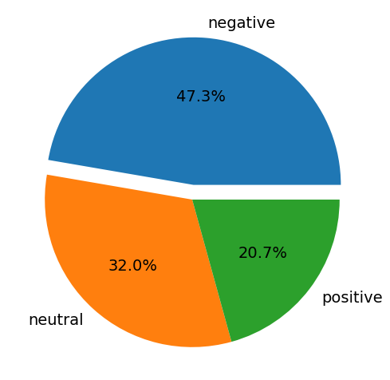
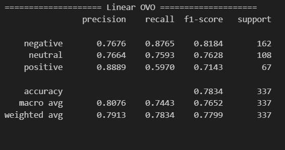
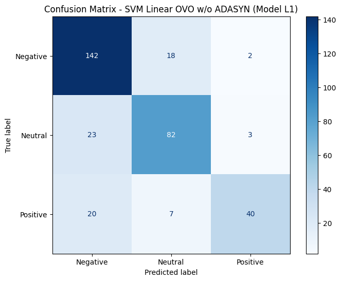

# 📊  Twitter Sentiment Analysis on Reopening of TikTok Shop: SVM with ADASYN

[](https://www.python.org/)
[](https://scikit-learn.org/)
[](https://opensource.org/licenses/MIT)

## 📌 Project Description
This project implements Sentiment Analysis on social media data (Twitter/X) using the **Support Vector Machine (SVM)** algorithm. The core focus is evaluating model performance through **4 experimental schemes** involving data balancing techniques (ADASYN) and various SVM multiclass strategies.

Initial data labeling was performed automatically using the **IndoBERT** model and manually validated to ensure high-quality ground truth labels before classification with SVM.

---

## 🛠️ Tech Stack
* **Language:** Python
* **Crawling** [tweet-harvest](https://github.com/helmisatria/tweet-harvest)
* **Labeling:** [IndoBERT](https://huggingface.co/mdhugol/indonesia-bert-sentiment-classification)
* **Modeling:** Support Vector Machine (Scikit-Learn)
* **Imbalance Handling:** ADASYN
* **NLP Tools:** Sastrawi (Stemming & Stopwords)

---

### 📂 Project Workflow
1.  **[01_crawling.ipynb](./notebooks/01_crawling.ipynb)**: Data acquisition from Twitter using tweet-harvest.
2.  **[02_preprocessing.ipynb](./notebooks/02_preprocessing.ipynb)**: Text cleaning (cleansing, normalization, stemming).
3.  **[03_labeling.ipynb](./notebooks/03_labeling.ipynb)**: Automatic labeling with IndoBERT & validated by human.
4.  **[04_modeling.ipynb](./notebooks/04_modeling.ipynb)**: Implementation of 4 SVM schemes and performance evaluation.


---

## 🚀 Research Methodology
This research compares **4 distinct modeling schemes** with the following combinations:
- **SVM Kernels:** Linear.
- **Data Split Ratio:** 80:20.
- **Multi-class Strategy:** One-vs-One (OvO) vs One-vs-Rest (OvR).
- **Data Balancing:** with vs without ADASYN (Oversampling).


---

## 📊 Results & Evaluation 

### 📈 Sentiment Polarity in Dataset


* *Initial data distribution before balancing.*

### 🏆 Best Performing Model: **Model L1**
The optimal performance was achieved using: **Linear Kernel, OvO Strategy, 80:20 Split, without ADASYN.**

* **Classification Report (Model L1)** 
* **Confusion Matrix (Model L1)** 

### 📊 Testing Accuracy for each SVM schemes 
| Model | Multiclass Strategy | ADASYN | Testing Accuracy |
|------|---------------------|--------|------------------|
| **L1** ⭐ | One-vs-One (OvO) | No | **0.7834** |
| L2 | One-vs-Rest (OvR) | No | 0.7448 |
| LA1 | One-vs-One (OvO) | Yes | 0.7300 |
| LA2 | One-vs-Rest (OvR) | Yes | 0.7181 |

---

## 📁 Project Structure
```text
.
├── 📁 data/             # Data samples (Raw & Labeled)
├── 📁 notebooks/        # Jupyter Notebooks (Preprocessing & Modeling)
├── 📁 results/          # Visualizations (Graphs & Reports)
├── 📄 .gitignore        # Files to exclude from Git
├── 📄 requirements.txt   # Required Python libraries
└── 📄 README.md          # Project documentation
```

--- 

## ⚠️ Disclaimer
The samples provided in this repository are for **demonstration purposes** only. They do not represent the full dataset used in the research to maintain data privacy and integrity.

---